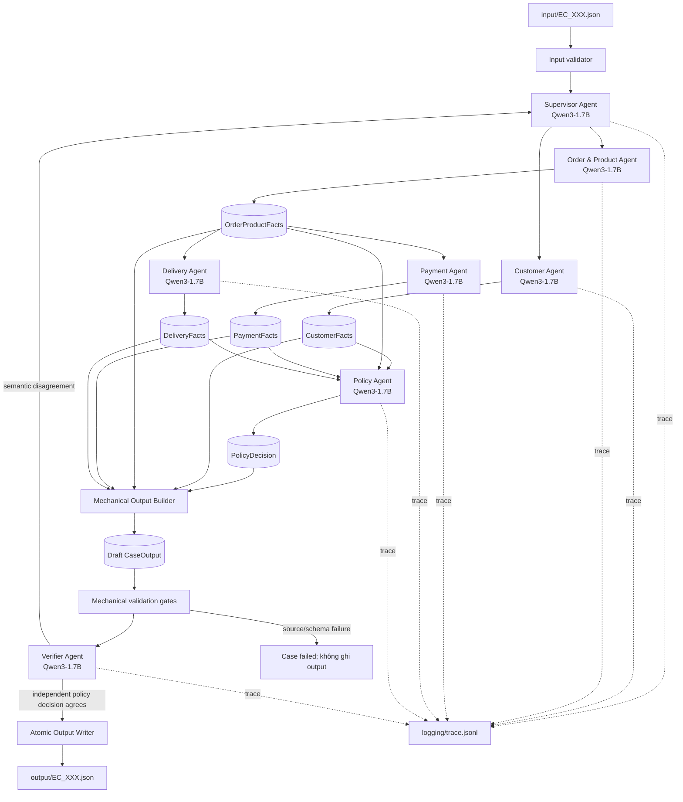

# Kiến trúc Multi-Agent E-commerce Dispute Resolution

## 1. Quyết định kiến trúc

Hệ thống dùng **Supervisor DAG**. `Supervisor Agent` sở hữu trạng thái của từng case, điều phối các agent chuyên môn và chỉ cho phép ghi file khi `Verifier Agent` trả kết quả hợp lệ.

Tất cả agent dùng chung một model local:

```text
repo: Qwen/Qwen3-1.7B-GGUF
file: Qwen3-1.7B-Q8_0.gguf
runtime: llama.cpp qua llama-cpp-python
device mặc định: CPU
```

Model được nạp một lần từ Hugging Face cache với `local_files_only=True`. Các agent có prompt, tool allowlist và Pydantic output schema riêng nhưng dùng chung model instance; inference được tuần tự hóa để tránh tranh chấp tài nguyên.

Policy không được quyết định bằng `if/elif` hay policy engine. `Policy Agent` phải sinh `PolicyDecision` có cấu trúc từ facts đã kiểm chứng. Code chỉ thực hiện các thao tác cơ học: đọc/join dữ liệu, cộng tiền, tính chênh lệch thời gian, kiểm tra schema, giới hạn mảng, nguồn ID/số tiền, projection sang output và ghi file atomic.

## 2. Sơ đồ tổng thể



## 3. Luồng thực thi một case

1. CLI đọc input, kiểm tra `case_id`, `claimed_order_id`, scope và `EC_POLICY_V2`.
2. Supervisor chọn route hợp lệ của DAG.
3. Customer Agent và Order & Product Agent truy xuất các nguồn dữ liệu được cấp quyền, rồi model phê duyệt handoff có cấu trúc.
4. Payment Agent dùng calculator để cộng toàn bộ payment và đối soát với item + freight.
5. Delivery Agent dùng datetime calculator để tính delivery variance và seller handoff variance.
6. Policy Agent nhận facts rút gọn và trực tiếp sinh toàn bộ `PolicyDecision` theo prompt `EC_POLICY_V2` cùng JSON Schema.
7. Output Builder chỉ chiếu facts/decision sang schema đầu ra và dựng evidence ID từ ID nguồn.
8. Mechanical gates kiểm tra schema, arithmetic, ID nguồn, array limit và sự toàn vẹn của phép chiếu.
9. Verifier không nhìn draft policy; model tự suy ra một `PolicyDecision` độc lập từ cùng facts. Runtime so sánh hai quyết định theo từng semantic field.
10. Nếu khác nhau, Supervisor gửi feedback về Policy Agent, tối đa hai vòng policy. Chỉ output đã pass mới được ghi atomic.

## 4. Vai trò và quyền truy cập

| Agent | Đầu vào | Quyền/tool | Handoff |
|---|---|---|---|
| Supervisor | phase và trạng thái handoff | xem state, dispatch, yêu cầu correction | route ID |
| Customer | claimed order ID, scope history | customer/order-history facade | `CustomerFacts` |
| Order & Product | claimed order ID, product scope | order/item/product/seller facade | `OrderProductFacts` |
| Payment | `OrderProductFacts` | payment facade, money calculator | `PaymentFacts` |
| Delivery | `OrderProductFacts` | datetime calculator | `DeliveryFacts` |
| Policy | bốn nhóm facts đã validate | chỉ xem facts | `PolicyDecision` |
| Verifier | facts và draft đã qua mechanical gates | validators, suy luận policy độc lập | `VerificationReport` |

Không agent nào được truy cập tool ngoài allowlist. Policy và Verifier không được đọc trực tiếp CSV; chúng chỉ nhận typed facts từ các agent điều tra.

## 5. Ranh giới “không rule-based”

Các thao tác sau là cơ học và được code thực hiện để tránh LLM làm sai số:

- join theo khóa dữ liệu và giữ thứ tự nguồn;
- cộng/round tiền, trừ timestamp;
- dựng stable ID và evidence ID;
- Pydantic/JSON Schema validation;
- kiểm tra ID và số tiền do model trả có tồn tại trong facts;
- so sánh hai structured decisions và ghi file atomic.

Các quyết định nghiệp vụ sau bắt buộc do model tạo:

- primary issue và thứ tự ưu tiên policy;
- secondary issues;
- case status, root cause và responsible parties;
- refund cần áp dụng và resolution actions;
- semantic verification độc lập.

Trong production không tồn tại `policies/ec_policy_v2.py`, bảng candidate hoặc chuỗi `if/elif` chọn kết quả nghiệp vụ.

## 6. Hợp đồng dữ liệu

Mỗi handoff dùng Pydantic model với `extra="forbid"`. Các enum policy, giới hạn array, tiền không âm và confidence `[0,1]` được khóa bằng JSON Schema ngay trong lúc llama.cpp decode. Model output sai schema, dùng ID/số tiền không có trong facts hoặc chứa phần tử trùng sẽ bị retry hữu hạn rồi fail case.

`CaseOutput` giữ nguyên schema trong README. Related orders chỉ nằm trong `customer_context`, không được đưa vào `affected_entities`.

## 7. Retry, trace và privacy

- Mỗi model decision có tối đa ba lần sửa schema/grounding.
- Policy có tối đa hai vòng khi Verifier đưa semantic disagreement.
- Lỗi terminal không tạo hoặc ghi đè output của case đó.
- `logging/trace.jsonl` được tạo mới cho mỗi run và ghi route, handoff cùng structured model decisions; không ghi system prompt, user prompt hoàn chỉnh, raw CSV row hay API key.
- `logging/metadata.json` ghi model, file GGUF, quantization, runtime, device, run ID và số case thành công/thất bại.
- Inference chạy local offline; code không dùng endpoint hay API key.

## 8. Cấu trúc source

```text
src/ecommerce_dispute/
├── agents/          # Supervisor và sáu specialist agents
├── data/            # Read-only Olist repository
├── llm/             # shared llama.cpp client
├── orchestration/   # CaseState, DAG, runner, output builder/writer
├── schemas/         # input, handoff và output contracts
├── tools/           # scoped facades, calculators, validators, evidence
├── tracing/         # JSONL trace writer
├── config.py        # fixed model/file và runtime settings
└── main.py          # CLI

prompts/             # role-specific system prompts
tests/               # unit và integration tests với scripted model
input/               # EC_001.json ... EC_050.json
output/              # verified case outputs
logging/             # trace.jsonl và metadata.json
```

## 9. Runtime model

```text
model: Qwen/Qwen3-1.7B-GGUF
file: Qwen3-1.7B-Q8_0.gguf
parameters: 1.7B
quantization: Q8_0
source: Hugging Face cache, local_files_only=True
context: 4096 tokens
generation: Qwen3 non-thinking sampling + llama.cpp JSON Schema constrained decoding
```

`MODEL_GPU_LAYERS=0` chạy CPU. Có thể tăng số layer offload khi máy đã có CUDA runtime tương thích; model name và filename vẫn cố định trong source để metadata và kết quả có thể tái lập.
