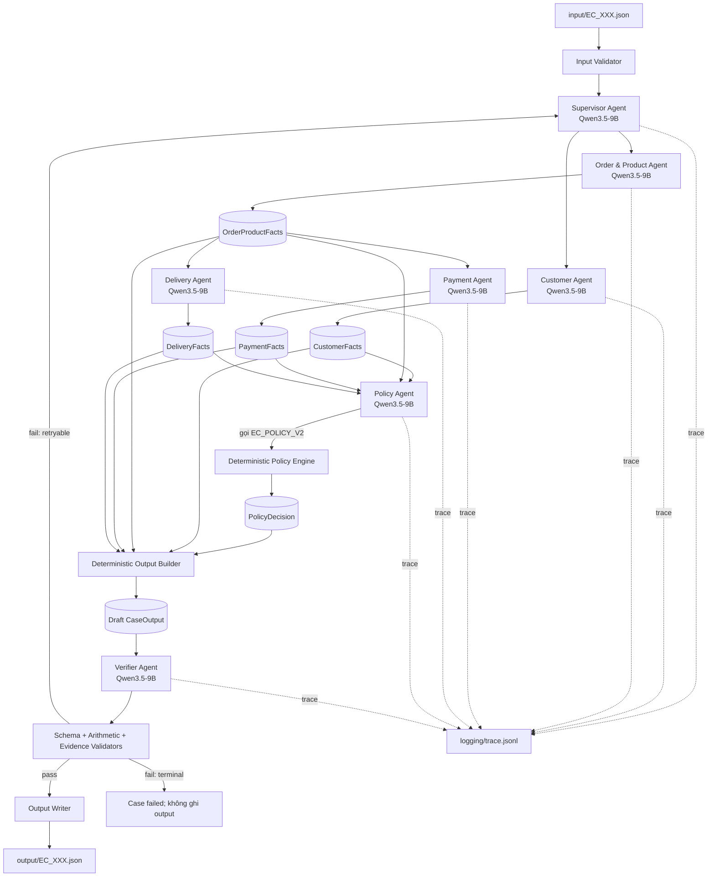
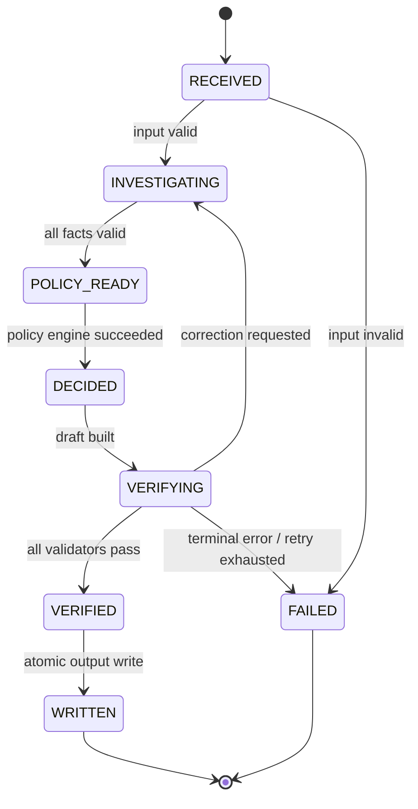

# Kiến trúc Multi-Agent E-commerce Dispute Resolution

## 1. Quyết định kiến trúc

Hệ thống sử dụng kiến trúc **Supervisor DAG**. Một `Supervisor Agent` giữ trạng thái của từng case, phân công các agent chuyên môn, kiểm soát điều kiện chuyển bước và chỉ cho phép ghi output sau khi `Verifier Agent` xác nhận kết quả hợp lệ.

Tất cả agent dùng chung model:

```text
Qwen/Qwen3.5-9B
```

Model được phục vụ qua một endpoint tương thích OpenAI API. Mỗi agent là một vai trò độc lập với system prompt, tool allowlist, input schema và output schema riêng; không tải một bản model riêng cho từng agent.

Các phép join dữ liệu, cộng tiền, tính giờ, áp `EC_POLICY_V2`, tạo evidence ID và kiểm tra JSON được thực hiện bằng code xác định. Model chịu trách nhiệm điều phối, lựa chọn tool, giải thích facts và tạo handoff có cấu trúc.

## 2. Sơ đồ tổng thể



## 3. Luồng thực thi một case

1. Input Validator đọc `EC_XXX.json`, kiểm tra tên file, `case_id`, `claimed_order_id`, `investigation_scope` và `policy_version`.
2. Supervisor tạo `CaseState` và giao song song hai nhiệm vụ đầu tiên cho Customer Agent và Order & Product Agent.
3. Customer Agent trả về identity và lịch sử mua hàng trong `CustomerFacts`.
4. Order & Product Agent trả về order, item, seller, product, category và tổng item/freight trong `OrderProductFacts`.
5. Khi có `OrderProductFacts`, Supervisor mở hai nhánh Payment Agent và Delivery Agent.
6. Payment Agent đối soát payment với item + freight bằng calculator tool và trả `PaymentFacts`.
7. Delivery Agent tính delivery variance và seller handoff variance bằng datetime tool rồi trả `DeliveryFacts`.
8. Khi đủ bốn nhóm facts, Policy Agent gọi policy engine để tạo `PolicyDecision` theo đúng thứ tự ưu tiên của `EC_POLICY_V2`.
9. Output Builder ghép facts và decision thành `CaseOutput`; model không được tự viết số tiền hoặc evidence ID ở bước này.
10. Verifier Agent và các validator code kiểm tra schema, null handling, giới hạn mảng, phép tính, evidence và tính nhất quán nghiệp vụ.
11. Nếu lỗi có thể sửa, Supervisor chỉ chạy lại agent sở hữu field sai, tối đa hai lần. Nếu pass, Output Writer ghi JSON và đóng case.

## 4. Vai trò và quyền truy cập

| Thành phần | Trách nhiệm | Dữ liệu/tool được phép | Không được phép |
| --- | --- | --- | --- |
| Supervisor Agent | Điều phối DAG, quản lý state, retry và timeout | Input schema, các handoff đã validate, graph state | Đọc toàn bộ CSV, tự tính tiền, tự sửa facts |
| Customer Agent | Xác định khách hàng và lịch sử order | `customers`, `orders`, customer lookup tools | Đưa order lịch sử vào `affected_entities` |
| Order & Product Agent | Điều tra order, item, seller, product, category | `orders`, `order_items`, `products`, `sellers` | Áp policy hoặc quyết định refund |
| Payment Agent | Tổng hợp payment và đối soát tiền | `order_payments`, `OrderProductFacts`, payment calculator | Tự làm tròn bằng văn bản hoặc suy đoán refund |
| Delivery Agent | Phân tích delivery và seller handoff | Order/item timestamps, delivery calculator | Suy đoán tracking checkpoint không có trong CSV |
| Policy Agent | Chọn taxonomy, responsibility, refund, actions | Bốn facts đã validate, `EC_POLICY_V2` tool | Bỏ qua thứ tự ưu tiên hoặc tạo policy mới |
| Verifier Agent | Tìm mâu thuẫn và định tuyến correction | Draft output, source-backed verifier tools | Ghi output trực tiếp |
| Output Writer | Ghi JSON cuối cùng | Chỉ `CaseOutput` có trạng thái verified | Sửa nội dung output |

Mọi data tool là read-only. Chỉ Output Writer có quyền ghi `output/`; Trace Writer chỉ được ghi `logging/trace.jsonl`.

## 5. Handoff contracts

Mọi handoff dùng JSON có schema và metadata chung:

```json
{
  "case_id": "EC_001",
  "sender": "customer_agent",
  "recipient": "supervisor_agent",
  "message_type": "customer_facts",
  "attempt": 1,
  "payload": {},
  "source_refs": ["order:<order_id>"]
}
```

Các payload chính:

| Contract | Producer | Consumer | Nội dung |
| --- | --- | --- | --- |
| `CustomerFacts` | Customer Agent | Supervisor, Policy, Output Builder | `customer_unique_id`, related orders, repeat flag |
| `OrderProductFacts` | Order & Product Agent | Payment, Delivery, Policy, Output Builder | order status, timestamps, items, sellers, products, categories, totals |
| `PaymentFacts` | Payment Agent | Policy, Output Builder | payment rows, types, totals, difference, reconciled |
| `DeliveryFacts` | Delivery Agent | Policy, Output Builder | delivery variance, handoff analysis, late seller IDs |
| `PolicyDecision` | Policy Agent | Output Builder | issue taxonomy, status, root cause, responsible parties, refund, actions |
| `VerificationReport` | Verifier Agent | Supervisor, Output Writer | pass/fail, field errors, owner agent, retryability |

Handoff không được chứa toàn bộ DataFrame hoặc toàn bộ CSV. Agent chỉ nhận các rows thuộc order đang điều tra và những facts tối thiểu cần cho nhiệm vụ.

## 6. Trạng thái DAG



Một case không được chuyển sang `POLICY_READY` khi thiếu bất kỳ contract bắt buộc nào. Một output không được ghi khi state chưa phải `VERIFIED`.

## 7. Policy engine và tính xác định

`EC_POLICY_V2` là decision table theo first-match. Code phải xét lần lượt:

1. `canceled_order_paid`
2. `unavailable_order_paid`
3. `late_delivery_seller`
4. `late_delivery_logistics`
5. `valid_split_payment`
6. `unsupported_late_claim`

Secondary issues và supplemental actions cũng được tạo theo thứ tự cố định trong README. Tất cả số tiền và số giờ được làm tròn hai chữ số bằng calculator tool. Nếu order không có item, các trường phụ thuộc item phải là `null`, không phải `0`.

## 8. Verification gates

Verifier chỉ trả `pass` khi toàn bộ gate sau thành công:

- File name khớp `case_id` và claimed order.
- Output hợp lệ theo Pydantic/JSON Schema.
- Primary issue thỏa đúng first-match policy.
- Secondary issues và actions đúng điều kiện, đúng thứ tự.
- Tổng item, freight, payment và difference được tính lại từ source rows.
- Delivery/handoff variance được tính lại từ timestamp gốc.
- Evidence ID đúng format và thực sự tồn tại trong dữ liệu hoặc policy table.
- `recommended_refund_brl` khớp primary issue.
- `action_required` chỉ xuất hiện khi refund lớn hơn 0.
- Các array không vượt giới hạn và giữ thứ tự ổn định.
- Related orders không xuất hiện trong `affected_entities.order_ids`.

## 9. Retry và xử lý lỗi

- Mỗi agent tối đa hai lần chạy cho một case.
- Schema lỗi được trả về chính agent tạo payload.
- Source data thiếu được biểu diễn bằng `null`/mảng rỗng theo README; không yêu cầu model suy đoán.
- Policy không match bất kỳ rule nào là terminal error để tránh tạo taxonomy ngoài đề.
- Ghi output theo kiểu atomic: tạo file tạm trong `output/`, validate lần cuối rồi thay tên.
- `trace.jsonl` được tạo mới cho mỗi lần chạy đủ 50 case, không append trace từ lần chạy trước.

## 10. Trace và metadata

Mỗi event trong `logging/trace.jsonl` có dạng:

```json
{"run_id":"...","case_id":"EC_001","event":"handoff","sender":"customer_agent","recipient":"supervisor_agent","attempt":1,"status":"success","payload_type":"CustomerFacts"}
```

Trace không ghi API key, prompt chứa secret hoặc toàn bộ CSV row không cần thiết. `logging/metadata.json` khai báo model cố định `Qwen/Qwen3.5-9B`, parameter size `9B`, framework và runtime thực tế.

## 11. Cấu trúc source

```text
src/ecommerce_dispute/
├── agents/          # Supervisor và sáu specialist agents
├── data/            # Read-only Olist repository
├── orchestration/   # CaseState và Supervisor DAG
├── policies/        # EC_POLICY_V2 deterministic engine
├── schemas/         # Input, handoff và output contracts
├── tools/           # Calculator và evidence tools
├── tracing/         # JSONL trace writer
├── config.py        # Model name cố định và runtime settings
└── main.py          # CLI entry point

prompts/             # System prompt riêng cho từng agent
tests/               # Unit/integration tests
input/               # 50 input JSON
output/              # 50 output JSON sau khi chạy
logging/             # trace.jsonl và metadata.json
```

## 12. Model serving

Toàn bộ agent gọi cùng một OpenAI-compatible endpoint:

```text
model: Qwen/Qwen3.5-9B
temperature: 0.0
response format: JSON theo contract của agent
```

Model name được khai báo trực tiếp trong source để đáp ứng yêu cầu chấm bài; endpoint và API key lấy từ `.env`. Với Qwen3.5-9B local, runtime nên bật text-only/language-model-only vì bài không cần vision.
