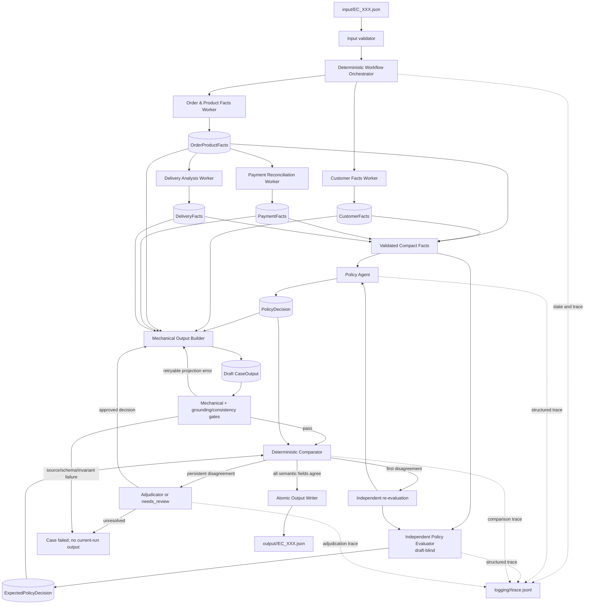

# Kiến trúc Multi-Agent E-commerce Dispute Resolution

> Tài liệu này mô tả **kiến trúc đích**. Workflow cố định được điều phối bằng code;
> LLM chỉ được dùng tại các bước cần suy luận nghiệp vụ.

## 1. Quyết định kiến trúc

Hệ thống dùng **deterministic workflow orchestrator** quản lý `CaseState` và thực thi một DAG
có kiểm soát. Orchestrator không phải LLM agent: route tiếp theo được xác định từ phase, dependency
và trạng thái handoff. Cách này loại bỏ chi phí, độ trễ và rủi ro khi yêu cầu model lặp lại một
route vốn chỉ có một lựa chọn hợp lệ.

Các bước đọc/join dữ liệu, tính tiền, tính chênh lệch thời gian và dựng typed facts là các
**domain workers** xác định, không phải model-backed agents. Hai agent suy luận chính là:

- `Policy Agent`: sinh quyết định nghiệp vụ từ facts đã kiểm chứng;
- `Independent Policy Evaluator`: tự suy ra quyết định kỳ vọng từ cùng facts nhưng không được
  nhìn draft hoặc output của Policy Agent.

Sau đó, `Deterministic Comparator` so sánh hai structured decisions theo từng semantic field.
Comparator là thành phần duy nhất được nhìn cả hai quyết định. Việc hai agent đồng ý là một
cross-check, không được coi là bằng chứng duy nhất về tính đúng; output còn phải qua schema,
source-grounding, arithmetic và các kiểm tra consistency tổng quát không suy ra đáp án policy.

Trong production, Policy Agent và Independent Evaluator nên dùng prompt riêng và model snapshot
khác nhau để giảm correlated failure. Nếu bài lab buộc dùng chung `gpt-4o-mini`, hai agent vẫn phải
dùng request/context độc lập và tài liệu phải ghi rõ đây chỉ là **logical independence**, không phải
model independence.

## 2. Sơ đồ tổng thể



## 3. Luồng thực thi một case

1. CLI đọc input và kiểm tra `case_id`, `claimed_order_id`, investigation scope và
   `policy_version`.
2. Orchestrator tạo `CaseState` gắn với `run_id` và chuyển case sang phase `investigating`.
3. Customer Facts Worker và Order & Product Facts Worker chạy song song, truy xuất dữ liệu qua
   capability-scoped read-only facades và trả typed facts.
4. Khi `OrderProductFacts` sẵn sàng, Payment Reconciliation Worker và Delivery Analysis Worker
   chạy song song. Mọi phép tính tiền và timestamp được thực hiện bằng calculator xác định.
5. Orchestrator validate bốn nhóm facts và tạo một projection rút gọn chỉ gồm dữ liệu cần thiết
   cho quyết định policy.
6. Policy Agent và Independent Policy Evaluator nhận cùng validated facts qua hai request độc lập.
   Evaluator không nhận `PolicyDecision`, draft output hoặc feedback chứa đáp án của Policy Agent.
7. Output Builder chiếu facts và `PolicyDecision` sang `CaseOutput`; component này không đưa ra
   quyết định nghiệp vụ.
8. Mechanical gates kiểm tra schema, arithmetic, ID/số tiền nguồn, giới hạn mảng, phép chiếu và
   các mâu thuẫn tổng quát; gates không tính đáp án `EC_POLICY_V2` kỳ vọng.
9. Khi mechanical gates pass, Comparator so sánh `PolicyDecision` và `ExpectedPolicyDecision`
   theo từng semantic field và tạo `VerificationReport`.
10. Nếu khác nhau lần đầu, hai agent được re-evaluate độc lập. Feedback chỉ mô tả field bất đồng,
    không tiết lộ giá trị của agent còn lại.
11. Nếu vẫn bất đồng, case được chuyển cho Adjudicator dùng prompt/model độc lập hoặc mang trạng
    thái `needs_review`. Không tự động ép Policy Agent sửa theo Evaluator.
12. Chỉ output pass toàn bộ gates và comparator/adjudication mới được ghi atomic vào namespace của
    run hiện tại.

## 4. Thành phần, trách nhiệm và quyền truy cập

| Thành phần | Đầu vào | Quyền/tool | Đầu ra |
|---|---|---|---|
| Workflow Orchestrator | phase, dependency, handoff status | chuyển phase, dispatch worker/agent, retry, fail | route và `CaseState` |
| Customer Facts Worker | claimed order ID, history scope | customer/order-history facade | `CustomerFacts` |
| Order & Product Facts Worker | claimed order ID, product scope | order/item/product/seller facade | `OrderProductFacts` |
| Payment Reconciliation Worker | `OrderProductFacts` | payment facade, money calculator | `PaymentFacts` |
| Delivery Analysis Worker | `OrderProductFacts` | datetime calculator | `DeliveryFacts` |
| Policy Agent | validated compact facts | chỉ xem facts và policy prompt | `PolicyDecision` |
| Independent Policy Evaluator | cùng validated compact facts | prompt/model riêng; không thấy draft | `ExpectedPolicyDecision` |
| Mechanical Validator | facts, draft, source references | schema, arithmetic, grounding, invariants | `MechanicalReport` |
| Deterministic Comparator | hai policy decisions đã validate | field-by-field comparison | `VerificationReport` |
| Adjudicator | facts và báo cáo bất đồng | model độc lập hoặc human review | quyết định phê duyệt hoặc `needs_review` |
| Atomic Output Writer | output đã được phê duyệt | chỉ ghi namespace của run hiện tại | output JSON |

Không component nào được truy cập ngoài capability allowlist. Policy Agent, Evaluator và
Adjudicator không được đọc trực tiếp CSV; chúng chỉ nhận typed facts tối thiểu cần thiết. Chỉ
Orchestrator được cập nhật `CaseState`; kết quả song song được trả về dưới dạng immutable handoff
rồi Orchestrator mới commit vào state.

## 5. Ranh giới giữa code xác định và suy luận bằng model

Code chịu trách nhiệm cho các thao tác có một đáp án khách quan:

- validate input, join theo khóa và giữ thứ tự nguồn;
- cộng/round tiền và trừ timestamp;
- tạo stable ID, evidence ID và source reference;
- dựng, validate và giới hạn typed handoff;
- kiểm tra ID/số tiền model trả có tồn tại trong facts;
- projection từ facts/decision sang output;
- kiểm tra consistency tổng quát mà không lựa chọn outcome;
- so sánh hai structured decisions;
- quản lý phase, retry, timeout, idempotency và atomic write.

Model chịu trách nhiệm cho các quyết định semantic được yêu cầu bởi `EC_POLICY_V2`:

- primary issue và thứ tự ưu tiên policy;
- secondary issues;
- case status, root cause và responsible parties;
- refund và resolution actions;
- đánh giá policy độc lập và adjudication khi cần.

Production path của dự án này bắt buộc model-driven: code không được chứa bảng ánh xạ primary,
không kiểm tra primary nào phải thắng, và không tự dựng secondary issues, root cause, parties,
refund hoặc actions kỳ vọng. Policy prompt là nơi mô tả `EC_POLICY_V2`; Evaluator và Adjudicator
tự áp dụng policy bằng model.

## 6. Hợp đồng dữ liệu và non-semantic safety gates

Mỗi handoff dùng Pydantic model với `extra="forbid"`. Enum policy, array limit, tiền không âm,
confidence `[0,1]` và các field bắt buộc được khóa bằng strict JSON Schema. Mọi schema đều có
`schema_version`; mọi quyết định đều mang `policy_version`, `prompt_version` và source-fact hash.

Ngoài field-level validation, Mechanical Validator chỉ kiểm tra các thuộc tính không cần suy ra
đáp án nghiệp vụ:

- tiền có tối đa hai chữ số thập phân;
- `no_action` không đi cùng refund dương và `action_required` không đi cùng refund bằng `0`;
- refund bằng `0` không đi cùng `verify_refund_completion`;
- seller chịu trách nhiệm phải tồn tại trong `OrderProductFacts`;
- refund phải là một source amount được phép;
- mọi evidence ID tồn tại trong source references;
- các collection không trùng và không vượt giới hạn schema;
- related orders chỉ nằm trong `customer_context`, không xuất hiện trong `affected_entities`.

Validator tuyệt đối không chứa điều kiện eligibility theo từng primary, bảng root/action/refund,
thứ tự ưu tiên policy hoặc expected outcome. Model output sai schema, grounding hoặc consistency
tổng quát được retry hữu hạn; bất đồng semantic chỉ được giải quyết bởi model độc lập/Adjudicator.

## 7. State, retry và failure handling

`CaseState` có state machine rõ ràng:

```text
received
  -> investigating
  -> facts_ready
  -> deciding
  -> mechanically_validated
  -> comparing
  -> verified | needs_review | failed
  -> written
```

Quy tắc vận hành:

- Orchestrator là single writer của state; worker/agent không mutate state trực tiếp.
- Mỗi handoff có `run_id`, `case_id`, `attempt`, `schema_version` và idempotency key.
- Lỗi network/rate limit được retry tối đa ba lần với exponential backoff và jitter.
- Schema/grounding error của model được retry tối đa ba lần trong cùng agent.
- Semantic disagreement được re-evaluate độc lập tối đa một vòng trước adjudication.
- Data-integrity hoặc invariant failure không retry mù quáng.
- Mỗi case có timeout tổng ngoài timeout của từng model request.
- Lỗi của một case không hủy các case độc lập còn lại.
- Không ghi hoặc ghi đè output khi case chưa verified.

Output được đặt dưới `output/<run_id>/` và đi kèm run manifest. Vì vậy một output cũ không thể bị
nhầm là kết quả thành công của run hiện tại. Manifest ghi rõ trạng thái `success`, `failed` hoặc
`needs_review` của từng case.

## 8. Concurrency và khả năng mở rộng

- Customer/Order workers chạy song song.
- Payment/Delivery workers chạy song song sau khi Order facts sẵn sàng.
- Policy Agent và Independent Evaluator có thể chạy song song sau khi toàn bộ facts được validate.
- Nhiều case có thể chạy đồng thời qua bounded semaphore; concurrency được cấu hình theo rate
  limit của provider.
- Model client dùng connection pool chung, nhưng retry budget và timeout được theo dõi riêng cho
  từng case/request.
- Orchestrator áp dụng backpressure thay vì tạo toàn bộ request cùng lúc.

Không dùng concurrency không giới hạn. Các operation ghi trace, manifest và output phải an toàn
khi nhiều case hoàn tất đồng thời.

## 9. Trace, observability và reproducibility

Mỗi run có namespace riêng:

```text
logging/<run_id>/trace.jsonl
logging/<run_id>/metadata.json
logging/<run_id>/manifest.json
output/<run_id>/EC_XXX.json
```

Trace ghi:

- run ID, case ID, component/agent, phase và attempt;
- route, handoff type, schema version và source-fact hash;
- exact model ID/snapshot, prompt version/hash và policy version;
- request ID của provider, latency, token usage và retry category;
- structured decision đã được redaction;
- comparator result, invariant failure và terminal status.

Trace không ghi API key, system prompt đầy đủ, user prompt đầy đủ hoặc raw CSV row. Metadata không
ghi parameter-count ước lượng không được nhà cung cấp công bố; trường này nên là `unknown` hoặc
`not_disclosed`. Chỉ cố định model alias là chưa đủ tái lập, vì vậy cần lưu exact snapshot/version
khi provider hỗ trợ.

## 10. Privacy và security

Facts gửi tới hosted model phải được giảm thiểu và phân loại trước khi truyền:

- chỉ gửi field cần cho policy, không gửi raw row hoặc nội dung không liên quan;
- pseudonymize customer/order/seller IDs khi không cần giá trị gốc để suy luận;
- mã hóa dữ liệu khi truyền và khi lưu;
- giới hạn quyền đọc trace/output theo vai trò;
- cấu hình retention và cơ chế xóa theo run/case;
- không ghi credential hoặc provider response thô;
- ghi nhận data residency, DPA và phê duyệt truyền dữ liệu ra ngoài môi trường;
- redaction cả structured decisions trước khi ghi log.

Mapping từ pseudonymous ID về source ID chỉ nằm trong trusted deterministic layer, không được gửi
cho model nếu không cần thiết.

## 11. Cấu trúc source đề xuất

```text
src/ecommerce_dispute/
├── agents/
│   ├── policy.py                 # Policy Agent
│   ├── evaluator.py              # draft-blind Independent Evaluator
│   └── adjudicator.py            # optional model/human-review adapter
├── workers/
│   ├── customer.py               # deterministic facts worker
│   ├── order_product.py
│   ├── payment.py
│   └── delivery.py
├── data/                          # read-only Olist repository
├── llm/                           # structured-model protocol and clients
├── orchestration/
│   ├── workflow.py                # deterministic DAG and state transitions
│   ├── state.py
│   ├── runner.py
│   ├── comparator.py
│   ├── output_builder.py
│   └── output_writer.py
├── schemas/                       # versioned input, facts, decisions, reports
├── validation/                    # schema, grounding and generic consistency
├── tools/                         # scoped facades, calculators, evidence
├── tracing/                       # per-run trace, metadata and manifest
├── config.py
└── main.py

prompts/
├── policy_agent.md
├── independent_evaluator.md
└── adjudicator.md

tests/
├── unit/                          # calculators, validators, state transitions
├── contract/                      # schema and handoff compatibility
├── golden/                        # EC_POLICY_V2 expected outcomes
├── integration/                   # complete DAG with scripted model
└── failure/                       # retry, timeout, disagreement, stale output
```

## 12. Runtime model và cấu hình

Các role dùng cấu hình riêng thay vì hard-code một model chung:

```text
POLICY_MODEL=<pinned model snapshot>
EVALUATOR_MODEL=<different pinned model snapshot>
ADJUDICATOR_MODEL=<optional stronger/different model>
OPENAI_BASE_URL=https://api.openai.com/v1
OPENAI_TIMEOUT_SECONDS=60
CASE_TIMEOUT_SECONDS=<bounded total timeout>
MAX_CASE_CONCURRENCY=<provider-aware limit>
```

Trong bài lab, `POLICY_MODEL` và `EVALUATOR_MODEL` có thể cùng là `gpt-4o-mini` nếu đó là ràng
buộc đề bài. Trong production, nên dùng evaluator khác model/snapshot hoặc thêm deterministic
policy oracle cho các quyết định tài chính. Mọi run phải ghi exact resolved model ID và phiên bản
prompt/schema vào metadata.

## 13. Tiêu chí chấp nhận kiến trúc

Kiến trúc chỉ được coi là sẵn sàng khi:

1. route cố định không phụ thuộc vào LLM;
2. domain facts có thể tái lập hoàn toàn từ cùng input/source;
3. Independent Evaluator không nhận draft hoặc đáp án của Policy Agent;
4. Comparator là deterministic và có test theo từng semantic field;
5. safety gates có test và không chứa policy outcome oracle;
6. disagreement kéo dài không tự động ghi output;
7. mỗi run phân biệt được output mới, output cũ và case thất bại;
8. concurrency, retry, timeout và rate limit đều có giới hạn;
9. trace đủ để audit nhưng không chứa credential/raw source;
10. model, prompt, schema và policy version được ghi chính xác để tái lập kết quả.
